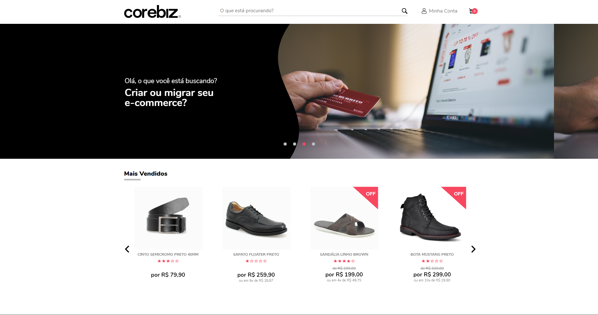

<h1 align="center">
    
</h1>

<h4 align="center"> 
	Corebiz Store
</h4>

<p align="center">
    
</p>

## Sobre o Projeto

Esse layout da Corebiz foi desenvolvido como parte do teste para Desenvolvedor Front-End. Objetivo do teste é avaliar o nível de conhecimento e experiência com layout e conhecimento nas tecnologias do VTEX IO.

## Sobre as APIs utilizadas

Como a API fornecida no documento do Desafio Técnico estava fora do ar, criei uma API fake com o My JSON Server para simular a API utilizada no teste. Ela pode ser acessa em: [https://my-json-server.typicode.com/marcosolvr/crbzapi/](https://my-json-server.typicode.com/marcosolvr/crbzapi/). 

## Tecnologias

Esse projeto foi desenvolvido com as seguintes tecnologias e bibliotecas:

- ReactJS
- Typescript
- SASS
- Axios
- Webpack
- React Alice Carousel
- Classnames

## Como Executar

Para executar esse layout, você vai precisar do Git e do NodeJS v18.12.0 (npm v8.19.2) instalados no seu computador.

```
# Clone esse repositóro
$ git clone https://github.com/marcosolvr/crbz-store.git

# Instale as dependências
$ npm install

# Execute o comando
$ npm run dev

# Acesse a url gerada no console do terminal
```

# Melhorias futuras

- Adicionar o menu lateral esquerdo no mobile para acessar a Minha Conta;

- Adicionar o carrinho na lateral direita para mostrar as informações dos produtos adicionandos;

- Melhorar a organização da estrutura do projeto;

- Adicionar configurações no Webpack para acessar os tipos de arquivos .png;

## Autor


